## Performance Analysis

---

### Before Optimization

| Action                  | Commit Duration (ms) | Render Duration (ms) | InteractionType |
| ----------------------- | -------------------- | -------------------- | --------------- |
| Sorting by name         | 2.6                  | 99                   | onClick         |
| Sorting population asc  | 2.9                  | 109.4                | onClick         |
| Sorting population desc | 2.3                  | 114.9                | onClick         |
| Searching a country     | 1.4                  | 56.2                 | onChange        |
| Selecting a year        | 2.4                  | 97.1                 | onChange        |
| Adding 2 columns        | 3.8                  | 86.3                 | onClick         |
| Removing 2 columns      | 3.2                  | 68.1                 | onClick         |

---

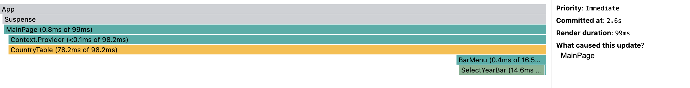
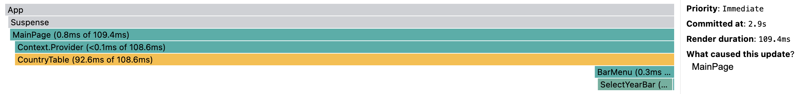
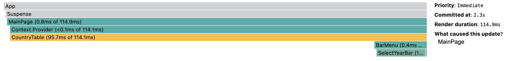

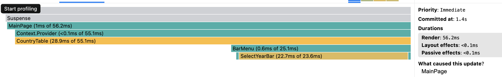
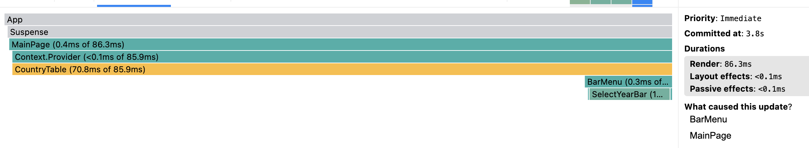
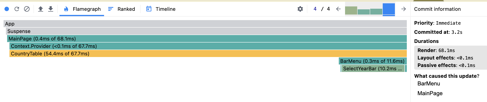

### After Optimization

| Action                  | Commit Duration (ms) | Render Duration (ms) | InteractionType |
| ----------------------- | -------------------- | -------------------- | --------------- |
| Sorting by name         | 2.1                  | 84.3                 | onClick         |
| Sorting population asc  | 1.8                  | 96.3                 | onClick         |
| Sorting population desc | 2.0                  | 96.3                 | onClick         |
| Searching a country     | 1.2                  | 32.4                 | onChange        |
| Selecting a year        | 1.9                  | 81.7                 | onChange        |
| Adding 2 columns        | 3.5                  | 79.7                 | onClick         |
| Removing 2 columns      | 3                    | 51                   | onClick         |

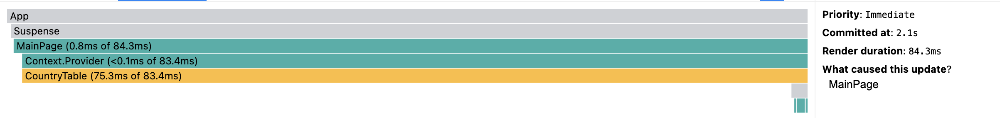
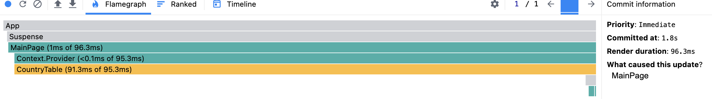
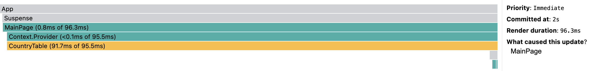
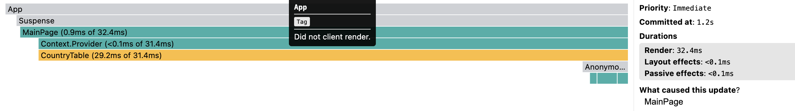
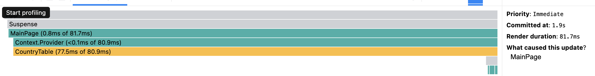
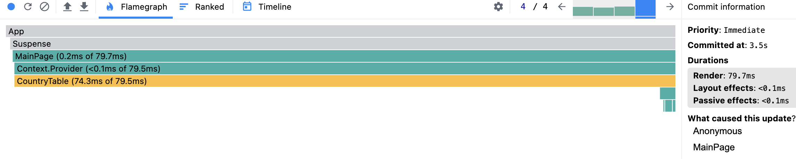
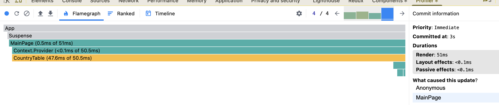

# Optimization techniques applied:

useMemo for context, filtering, searching, sorting
useCallback for event handlers
Suspense for Main component
